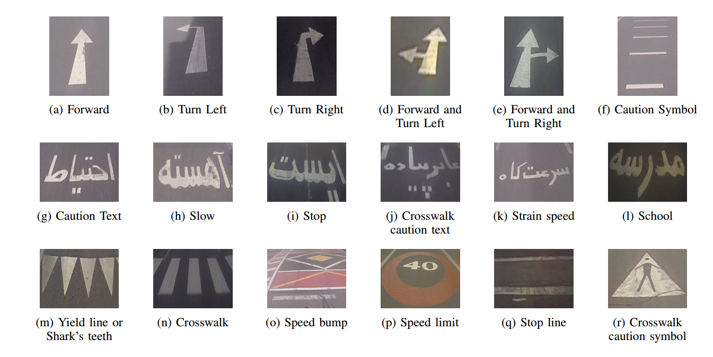

# PRSM
Persian Road Surface Marking (PRSM) Dataset: The dataset consists of over 6800 labeled images of Persian road surface markings in 18 popular classes. It also contains road surface markings under various daylight conditions such as sunny, sunset, and nighttime. Furthermore, this dataset contains images of marking signs in three different qualities, excellent, fair, and poor. The poor images have serious occlusion, motion blur, or are depreciated.
You can download the official version of the PRSM dataset by clicking on the following link.
http://display.sbu.ac.ir/submission_prsm-dataset/

# Classes of captured road surface marking
| Class name | Number of training samples | Number of testing samples | Total number of samples in each class | Proportion |
|---|---|---|---|---|
| Caution Text | 3441 | 1474 | 4915 | 9.80 % |
| Caution Symbol | 1277 | 547 | 1824 | 3.64 % |
| Yield line or Shark’s teeth | 2463 | 1056 | 3519 | 7.01 % |
| Crosswalk | 19525 | 8368 | 27893 | 19.93 % |
| Crosswalk Caution Text | 163 | 70 | 233 | 0.46 % |
| Crosswalk Caution Symbol | 826 | 354 | 1180 | 2.35 % |
| Forward | 4023 | 1724 | 5747 | 11.45 % |
| Forward and Turn Left | 674 | 289 | 963 | 1.92 % |
| Forward and Turn Right | 1462 | 627 | 2089 | 4.16 % |
| School | 760 | 325 | 1085 | 2.16 % |
| Slow | 2737 | 1173 | 3910 | 7.79 % |
| Speed Bump | 3758 | 1610 | 5368 | 10.70 % |
| Speed Limit | 135 | 58 | 193 | 0.38 % |
| Stop | 1241 | 532 | 1773 | 3.53 % |
| Stop Line | 3931 | 1684 | 5615 | 11.19 % |
| Strain Speed | 657 | 281 | 938 | 1.87 % |
| Turn Left | 142 | 61 | 203 | 0.40 % |
| Turn Right | 438 | 187 | 625 | 1.25 % |
| Total Number of Samples | 47653 | 20420 | 68073 | 100 % |

# Annotation tool
**To use annotation tools:**
1. Place your images in the annotation tool's designated folder.
2. Run the application responsible for image tagging (e.g., tag_fig)

# classification
Accuracy Comparison of Different Classifiers and Feature Extraction

| Classifier | Accuracy | KNN | Length of Feature Vector |
|---|---|---|---|
| SVM | 0.87 | 0.97 | 6400 |
| HOG | 0.85 | 0.98 | 9216 |
| POEM | 0.89 | 0.93 | 8496 |
# Contact 
Any questions or discussions are welcome! Please raise an issue (preferred), or send me an email.

Neehar Peri [sharifinjf@gmail.com]
